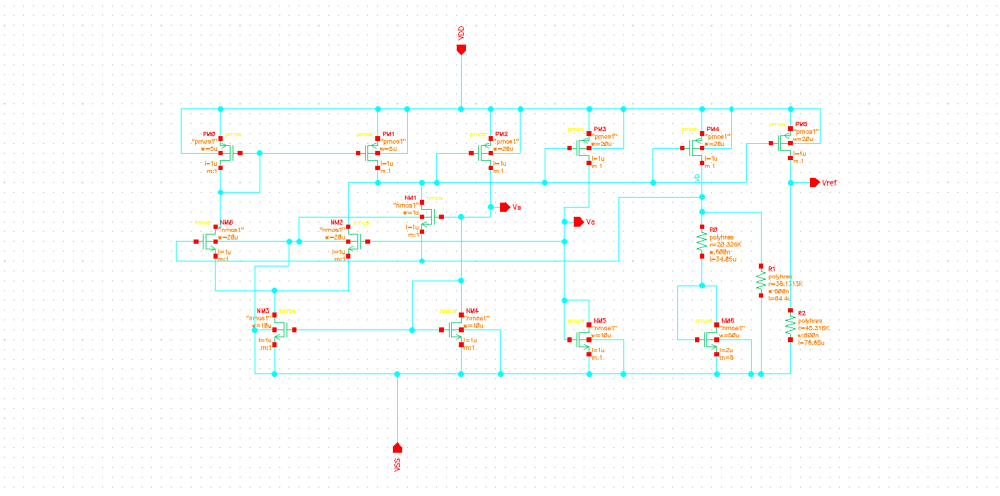
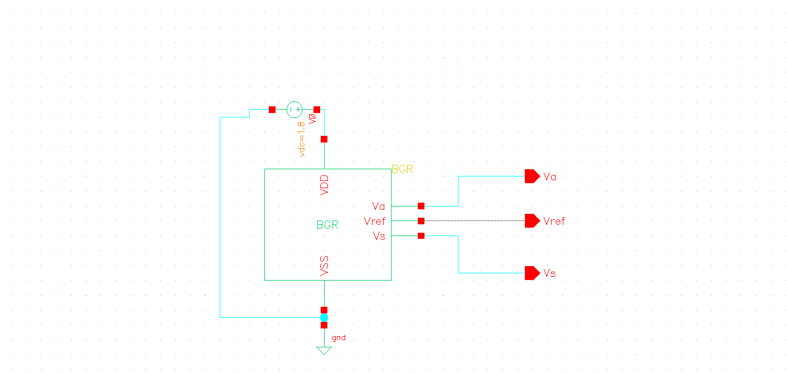
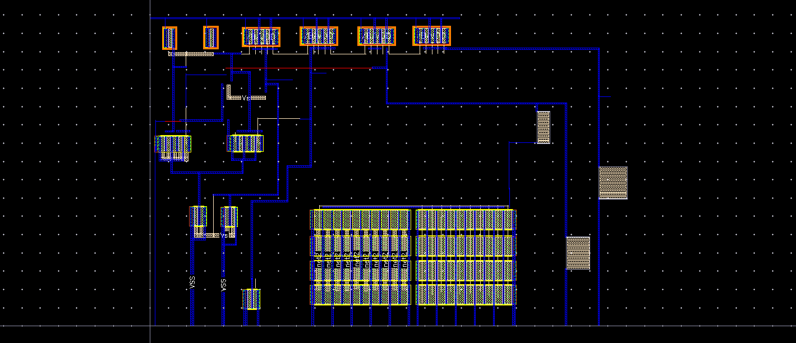
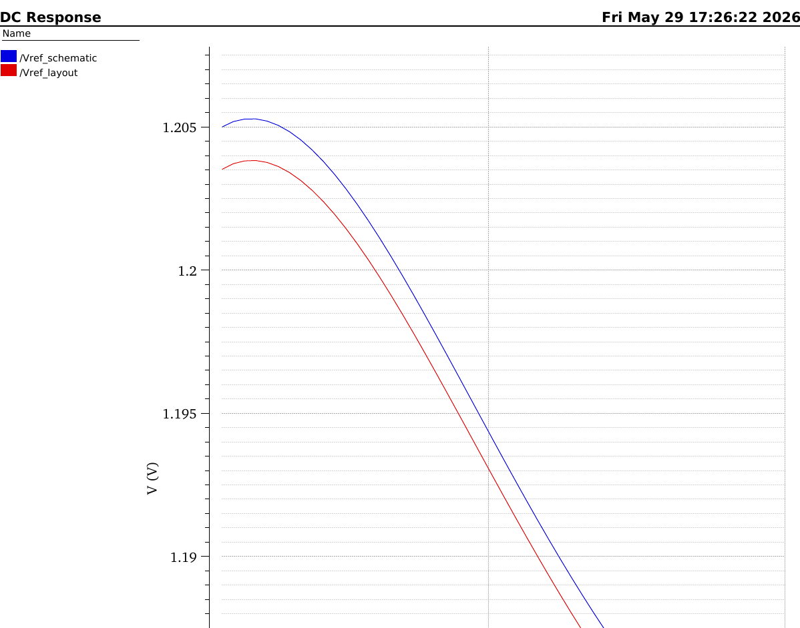

# 🔬 CMOS Self-Biased Bandgap Reference (BGR) — Complete Design & Analysis

> **Course:** BEC605 — Principles of Digital VLSI  
> **Institution:** The National Institute of Engineering (NIE), Mysuru — 570 008  
> **Department:** Electronics & Communication Engineering | Semester VI | Section: EC-B  
> **Date of Submission:** 04-06-2026  
> **Supervisor:** Mrs. Deepthi M S, Assistant Professor, Dept. of ECE, NIE, Mysore

---

## 📚 Table of Contents

1. [Project Overview](#1-project-overview)
2. [What is a Bandgap Reference (BGR)?](#2-what-is-a-bandgap-reference-bgr)
3. [BGR Theory — From Basics to Advanced](#3-bgr-theory--from-basics-to-advanced)
4. [CMOS Self-Biased BGR Architecture](#4-cmos-self-biased-bgr-architecture)
5. [Design Specifications & Component Details](#5-design-specifications--component-details)
6. [Circuit Schematic & Test Setup](#6-circuit-schematic--test-setup)
7. [Simulation Results](#7-simulation-results)
8. [Layout Design](#8-layout-design)
9. [Post-Layout Simulation](#9-post-layout-simulation)
10. [Applications](#10-applications)
11. [Comparison: Conventional vs Self-Biased BGR](#11-comparison-conventional-vs-self-biased-bgr)
12. [Reference Learning Materials](#12-reference-learning-materials)
13. [Conclusion](#13-conclusion)
14. [How to Reproduce](#14-how-to-reproduce)
15. [References](#15-references)

---

## 1. Project Overview

This project presents the **complete design, simulation, layout, and verification** of a **CMOS Self-Biased Bandgap Reference (SBBGR)** circuit implemented in **180 nm CMOS technology** using **Cadence Virtuoso**. The circuit generates a highly stable reference voltage of approximately **1.2 V**, with minimal sensitivity to temperature (−40°C to +125°C), supply voltage, and process variations.

### Key Highlights

- ✅ Technology: GPDK 180 nm CMOS
- ✅ Supply Voltage: 1.8 V
- ✅ Reference Output: ~1.2 V
- ✅ Temperature Range: −40°C to +125°C
- ✅ DRC Clean Layout
- ✅ LVS Verified
- ✅ Post-Layout Simulation Matches Schematic

> 📷 **Screenshot to upload:** `images/pdf1_final_report/page1_cover.png`  
> *(Source: BGR_FINAL_REPORT.pdf — Page 1 — Cover page showing title, team, and institution)*

---

## 2. What is a Bandgap Reference (BGR)?

A **Bandgap Reference (BGR)** is a temperature-independent voltage reference circuit widely used in analog and mixed-signal integrated circuits. It provides a **constant voltage** regardless of:

- Power supply variations
- Temperature changes (−40°C to +125°C in industry)
- Circuit loading from devices

### Why not use a Battery or Power Supply as reference?

| Reference Source | Problem |
|-----------------|---------|
| Battery | Voltage drops over time; affected by temperature and load |
| Power Supply | Noise from switching circuits; ripple from AC-DC conversion; load-dependent |
| Zener Diode | Requires resistor, filtering cap, bias circuits; high thermal noise; low-voltage Zeners unavailable |
| **BGR** ✅ | Stable ~1.2 V, temperature-independent, process-tolerant |

### Why ~1.2 V Output?

The ~1.2 V output corresponds to **silicon's bandgap energy extrapolated to 0 K**:

```
Eg/q ≈ 1.205 V  (for silicon)
```

CTAT + PTAT naturally sum to this value, making it a **physics-based** reference — not arbitrarily chosen.

> 📷 **Screenshot to upload:** `images/pdf3_workshop_notes/page3_bgr_intro.png`  
> *(Source: BGR_VSD_Written_notes_workshop.pdf — Page 3 — Handwritten intro to BGR with PTAT/CTAT graphs)*

> 📷 **Screenshot to upload:** `images/pdf3_workshop_notes/page4_why_bgr.png`  
> *(Source: BGR_VSD_Written_notes_workshop.pdf — Page 4 — Why BGR: battery/supply/zener comparison)*

---

## 3. BGR Theory — From Basics to Advanced

### 3.1 CTAT — Complementary To Absolute Temperature

**CTAT** voltage decreases as temperature increases. It is generated using the **base-emitter voltage (V_BE)** of a BJT transistor.

**Circuit:**  
A constant current I₀ flows through a diode-connected BJT (Q₁):

```
V_CTAT = V_BE = V_T × ln(I₀ / I_S)
```

**Temperature Coefficient:**
```
∂V_BE / ∂T ≈ −1.6 to −2.0 mV/°C
```

**Why does V_BE decrease with temperature?**

```
I = I_S × [e^(V_BE/V_T) − 1]
```
- I is fixed (constant current source)
- As Temperature ↑ → I_S ↑ → less V_BE needed to maintain same current → **V_BE ↓**

**Effect of emitter area on CTAT slope:**

| BJT Configuration | CTAT Slope | Reason |
|-------------------|-----------|--------|
| Q₁ = 1 (single BJT) | Less negative slope | Full I₀ flows |
| Q₁ = 8 (parallel BJTs) | More negative slope | I₀/8 per device → bigger % change |

> 📷 **Screenshot to upload:** `images/pdf3_workshop_notes/page9_ctat_bjt.png`  
> *(Source: BGR_VSD_Written_notes_workshop.pdf — Page 9 — Why BJT used instead of diode, CTAT generation with diode-connected PNP)*

> 📷 **Screenshot to upload:** `images/pdf3_workshop_notes/page10_ctat_why_vbe_decreases.png`  
> *(Source: BGR_VSD_Written_notes_workshop.pdf — Page 10 — Mathematical derivation of why V_BE decreases, second-order temperature effect)*

> 📷 **Screenshot to upload:** `images/pdf3_workshop_notes/page11_ctat_slopes.png`  
> *(Source: BGR_VSD_Written_notes_workshop.pdf — Page 11 — CTAT slope variation with BJT count and current)*

---

### 3.2 PTAT — Proportional To Absolute Temperature

**PTAT** voltage increases linearly with temperature. It is derived from the **difference in V_BE** of two BJTs operating at different current densities.

**Derivation:**

Using two BJTs (Q₁ with area A₁, Q₂ with area N×A₁), both carrying current I₀:

```
V_D = V_T × ln(I₀ / I_S)   [for Q₁, single BJT]

V_D₁ = V_T × ln(I₀ / (N × I_S))  [for Q₂, N parallel BJTs]

∴ ΔV_BE = V_D − V_D₁ = V_T × ln(N)   ← PTAT
```

Since V_T = kT/q is directly proportional to T, **ΔV_BE ∝ T** (PTAT).

**Temperature Coefficient:**
```
∂(PTAT) / ∂T = (k/q) × ln(N) ≈ +0.085 mV/°C × ln(N)

For N = 8:  ΔV_BE slope ≈ +0.176 mV/°C
```

**Resistor R₁ Role:**  
Placed in series with Q₂ to convert the PTAT voltage into a PTAT current:
```
I₀ × R₁ = V_T × ln(N)
∴ I₀ = V_T × ln(N) / R₁   ← PTAT current
```

> 📷 **Screenshot to upload:** `images/pdf2_reference/page5_ptat_design.png`  
> *(Source: BGR.pdf — Page 5 — Handwritten derivation of PTAT using two BJTs with different emitter areas)*

> 📷 **Screenshot to upload:** `images/pdf3_workshop_notes/page12_ptat_circuit.png`  
> *(Source: BGR_VSD_Written_notes_workshop.pdf — Page 12 — PTAT generation circuit with current mirror, slope = 0.085 mV/°C)*

---

### 3.3 Combining CTAT and PTAT — The Bandgap Equation

Theoretically:
```
PTAT + CTAT = Constant Voltage
```

But **practically**, CTAT is ~23× steeper than PTAT, so they **cannot cancel directly**. A scaling factor α is needed:

```
α₁ × PTAT + α₂ × CTAT = V_ref (constant)
```

**Condition for zero temperature coefficient:**
```
∂V_ref / ∂T = 0

α₁ × (∂PTAT/∂T) + α₂ × (∂CTAT/∂T) = 0

α₁ × (85 μV/°C) + α₂ × (−1.6 mV/°C) = 0

If α₂ = 1:
    α₁ = 1.6 mV / 85 μV = 18.82
```

**Final Reference Voltage:**
```
V_ref = α₁ × V_T + V_D
       = 18.82 × 26 mV + 0.7 V
       ≈ 1.2 V   ← Standard BGR output
```

> 📷 **Screenshot to upload:** `images/pdf2_reference/page6_combining_ptat_ctat.png`  
> *(Source: BGR.pdf — Page 6 — Derivation of α₁ = 18.82 and final V_ref ≈ 1.2 V)*

> 📷 **Screenshot to upload:** `images/pdf2_reference/page8_alpha_design.png`  
> *(Source: BGR.pdf — Page 8 — Design of α₁ and α₂, scaling factor calculation)*

---

### 3.4 Why BJT Instead of Plain Diode in CMOS Process?

In CMOS, three BJT-style structures are possible:

| Structure | Type | Issue |
|-----------|------|-------|
| N-well diode | Simple diode | P-substrate must be GND — not possible in shared substrate |
| Diode-connected NMOS | Not accurate | Difficult for PTAT generation |
| Parasitic Vertical PNP BJT ✅ | p⁺/n-well/p-substrate | Provides exponential V_BE and area scaling for PTAT |

**Reasons to use Parasitic PNP BJT:**
1. P-substrate is always grounded in CMOS — prevents substrate current issues
2. Accurate PTAT generation via emitter area scaling
3. Better matching (Q₂ = 8 unit cells of Q₁, arranged in common-centroid layout)

> 📷 **Screenshot to upload:** `images/pdf3_workshop_notes/page9_bjt_cmos_structures.png`  
> *(Source: BGR_VSD_Written_notes_workshop.pdf — Page 9 — Three BJT/diode structures in CMOS, why parasitic PNP is used)*

---

### 3.5 Second-Order Temperature Effects (Tempco)

In practice, V_ref is not perfectly flat — it has a slight **umbrella/bow shape**:

- PTAT is nearly linear ✅
- CTAT (V_BE) has a **slight non-linear curvature** due to I_S temperature dependence
- Linear PTAT cannot perfectly cancel a curved CTAT
- V_ref **drops slightly at temperature extremes**

This residual error is measured as **Temperature Coefficient (Tempco)** in **ppm/°C**:

```
Tempco = (ΔV_ref / V_ref) / ΔT × 10⁶  [ppm/°C]
```

**Process corner effect on Tempco:**
- TT corner: ~21.7 ppm/°C
- FF corner: ~10 ppm/°C
- SS corner: ~45 ppm/°C (worst case, near design spec limit of 50 ppm/°C)

> 📷 **Screenshot to upload:** `images/pdf3_workshop_notes/page23_tempco_corners.png`  
> *(Source: BGR_VSD_Written_notes_workshop.pdf — Page 23 — Tempco formula, process corner values, umbrella shape explanation)*

---

### 3.6 BGR Types — Architecture Wise

#### Type 1: Self-Biased Current Mirror BGR

| Feature | Details |
|---------|---------|
| Principle | Circuit automatically biases itself — no external bias needed |
| Components | Current mirrors + 2 BJTs + Resistors |
| Advantage | Simple design, low area, no op-amp, always stable |
| Disadvantage | Limited accuracy, poor PSRR, sensitive to mismatch, needs startup circuit |

#### Type 2: Operational Amplifier Based BGR

| Feature | Details |
|---------|---------|
| Principle | Op-amp forces two nodes to equal voltage using negative feedback |
| Advantage | High accuracy, high PSRR, better matching, stable operation |
| Disadvantage | Larger area, higher power, requires startup circuit |

> 📷 **Screenshot to upload:** `images/pdf3_workshop_notes/page8_bgr_types.png`  
> *(Source: BGR_VSD_Written_notes_workshop.pdf — Page 8 — Self-biased current mirror vs op-amp BGR pros/cons)*

> 📷 **Screenshot to upload:** `images/pdf3_workshop_notes/page7_bgr_types_architecture.png`  
> *(Source: BGR_VSD_Written_notes_workshop.pdf — Page 7 — BGR types: architecture-wise and application-wise classification)*

---

## 4. CMOS Self-Biased BGR Architecture

### 4.1 Four Major Blocks

```
                    VDD
                     |
    ┌────────────────────────────────────┐
    │           STARTUP CIRCUIT          │
    │  MP4, MP5, MP6, MN3, MN4          │
    └────────────┬───────────────────────┘
                 |
    ┌────────────────────────────────────┐
    │    SELF-BIASED CURRENT MIRROR      │
    │     (SBCM): MP1, MP2, MN1, MN2   │
    └────┬──────────────────┬────────────┘
         |                  |
    ┌────▼──────┐    ┌──────▼──────────────┐
    │   CTAT    │    │       PTAT          │
    │ GENERATOR │    │   GENERATOR         │
    │    Q1     │    │   Q2 + R1           │
    └────┬──────┘    └──────┬──────────────┘
         |                  |
    ┌────▼──────────────────▼────────────┐
    │     REFERENCE VOLTAGE BRANCH       │
    │         MP3, Q3, R2                │
    │       V_REF ≈ 1.2 V               │
    └────────────────────────────────────┘
```

> 📷 **Screenshot to upload:** `images/pdf1_final_report/page3_intro_circuit.png`  
> *(Source: BGR_FINAL_REPORT.pdf — Page 3 — Full circuit diagram embedded in introduction)*

> 📷 **Screenshot to upload:** `images/pdf1_final_report/page4_circuit_diagram.png`  
> *(Source: BGR_FINAL_REPORT.pdf — Page 4 — Detailed CMOS Self-Biased BGR circuit diagram with labeled transistors)*

---

### 4.2 Block 1: Startup Circuit

**Transistors:** MP4, MP5, MP6, MN3, MN4

**Problem it solves:**  
A self-biased circuit has **two stable operating points**:
1. ✅ Desired point — all currents at nominal values (~10 μA), BGR works correctly
2. ❌ Zero-current point — everything stuck at 0 A, circuit is dead

The startup circuit **detects the zero-current state** and **injects a kick current** to push the circuit to the desired operating point.

**How it works (step-by-step):**

| Step | Event |
|------|-------|
| Power ON | net2 ≈ VDD, net6 pulled LOW by MN3 (always weakly ON) |
| Zero current state | MN3 slowly pulls net6 toward GND |
| Trigger condition | When (net2 − net6) > V_th → MPS turns ON |
| Kick | MPS injects current into net1, raising net1 voltage |
| BGRstarts | MN1, MN2 turn ON → CTAT and PTAT branches activate |
| Normal operation | net2 voltage drops → MPS turns OFF automatically |
| Steady state | Startup completely inactive, V_ref = 1.2 V |

**Two rules for startup circuit design:**
- **Rule 1:** Must kick circuit out of zero-current state at power-ON
- **Rule 2:** Must NOT interfere once BGR is running

> 📷 **Screenshot to upload:** `images/pdf1_final_report/page5_startup_circuit.png`  
> *(Source: BGR_FINAL_REPORT.pdf — Page 5 — Startup circuit description)*

> 📷 **Screenshot to upload:** `images/pdf3_workshop_notes/page11_startup_circuit.png`  
> *(Source: BGR_VSD_Written_notes_workshop.pdf — Page 11 — Startup circuit diagram and two operating regions)*

> 📷 **Screenshot to upload:** `images/pdf3_workshop_notes/page21_startup_steps.png`  
> *(Source: BGR_VSD_Written_notes_workshop.pdf — Page 21 — Step-by-step startup sequence: net2, MPS, net1 rise, BGR start)*

---

### 4.3 Block 2: Self-Biased Current Mirror (SBCM)

**Transistors:** MP1, MP2, MN1, MN2

**Key Principle:**  
Unlike a normal current mirror that needs an external reference current (set by a boss), the SBCM **derives its own reference from its output** (sets its own salary based on work output — feedback loop).

```
I_ref is a replica of I_out
MP1 and MP2 are PMOS current mirrors with same gate voltage
∴ Current through MP1 copies MP2 as I_out (depending on W/L)
```

**Why it is independent of VDD:**  
Both I_ref and I_out come from diode-connected devices feeding into current sources. If VDD changes, **both change equally** and the ratio stays the same.

**Stability:**  
Adding resistor R_S in series with MN2's source:
```
I_out = [μn × Cox × (W/L)_N] × (1/R_S²) × [1 − 1/√k]²
```
VDD does not appear anywhere in this equation → **VDD independent**.  
Loop gain < 1 by default → **always stable**.

> 📷 **Screenshot to upload:** `images/pdf3_workshop_notes/page16_sbcm.png`  
> *(Source: BGR_VSD_Written_notes_workshop.pdf — Page 16 — Self-biased current mirror circuit, Iref = replica of Iout)*

> 📷 **Screenshot to upload:** `images/pdf3_workshop_notes/page17_sbcm_resistor.png`  
> *(Source: BGR_VSD_Written_notes_workshop.pdf — Page 17 — Adding Rs for unique operating point, stability analysis)*

---

### 4.4 Block 3: CTAT Generation

**Transistor:** Q1 (diode-connected PNP BJT, emitter area = 1 unit)

```
V_CTAT = V_BE(Q1) ≈ 0.6–0.7 V
∂V_CTAT / ∂T ≈ −2 mV/°C
```

The current I₁ (mirrored from SBCM) flows through Q1, generating a CTAT voltage at the collector node.

---

### 4.5 Block 4: PTAT Generation

**Transistors/Resistors:** Q2 (emitter area = 8 × Q1) + Resistor R1

```
Q2 = 8 × Q1  →  N = 8

ΔV_BE = V_T × ln(8) = 26 mV × 2.079 ≈ 54 mV (at 300 K)

I₀ = ΔV_BE / R1 = V_T × ln(N) / R1   ← PTAT current

This current through R1 generates the PTAT voltage component.
```

---

### 4.6 Block 5: Reference Voltage Generation Branch

**Transistors/Resistors:** MP3, Q3, R2

```
V_REF = V_BE(Q3) + I₃ × R2
      = CTAT + PTAT
      = V_D + (R2/R1) × V_T × ln(N)
```

The ratio R2/R1 = α is designed so that:
```
α × ln(N) × (∂V_T/∂T) + ∂V_BE/∂T = 0

α = 1.6 mV / (ln(8) × 0.085 mV) = 9.05

R2 = α × R1 = 9.05 × 5.4 kΩ ≈ 48.9 kΩ
```

> 📷 **Screenshot to upload:** `images/pdf1_final_report/page6_ptat_ctat_blocks.png`  
> *(Source: BGR_FINAL_REPORT.pdf — Page 6 — PTAT block (Q2, R1) and Reference branch (MP3, Q3, R2) descriptions with equations)*

> 📷 **Screenshot to upload:** `images/pdf3_workshop_notes/page18_reference_branch.png`  
> *(Source: BGR_VSD_Written_notes_workshop.pdf — Page 18 — Reference branch circuit: Q3, R2, MP3, V_ref = PTAT + CTAT)*

> 📷 **Screenshot to upload:** `images/pdf3_workshop_notes/page19_r2_design.png`  
> *(Source: BGR_VSD_Written_notes_workshop.pdf — Page 19 — Design of R2 resistance, Tempco formula, α = 9.05, R2 = 48.9 kΩ)*

> 📷 **Screenshot to upload:** `images/pdf3_workshop_notes/page20_design_summary.png`  
> *(Source: BGR_VSD_Written_notes_workshop.pdf — Page 20 — Summary table: Vt, branch current, R1, α, R2 with values)*

---

## 5. Design Specifications & Component Details

### 5.1 Technology Specifications

| Parameter | Value |
|-----------|-------|
| Technology | GPDK 180 nm CMOS |
| Supply Voltage (VDD) | 1.8 V |
| Temperature Range | −40°C to +125°C |
| Target V_REF | ~1.2 V |
| Architecture | CMOS Self-Biased Bandgap Reference |

### 5.2 Component Table

| SI No | Component | Library | W/L Value | Quantity |
|-------|-----------|---------|-----------|----------|
| 1 | PMOS (PM0, PM1, PM2, PM3) | gpdk180 | W=20μm, L=1μm | 4 |
| 2 | PMOS (PM4, PM5) | gpdk180 | W=5μm, L=1μm | 2 |
| 3 | NMOS (NM3, NM4, NM5) | gpdk180 | W=10μm, L=1μm | 3 |
| 4 | NMOS (NM1) | gpdk180 | W=1μm, L=1μm | 1 |
| 5 | NMOS (NM6) | gpdk180 | W=50μm, L=2μm, m=8 | 1 |
| 6 | NMOS (NM0) | gpdk180 | W=20μm, L=1μm | 1 |
| 7 | NMOS (NM2) | gpdk180 | W=20μm, L=1μm | 1 |
| 8 | Polyh Resistor R0 | gpdk180 | 20.326 kΩ | 1 |
| 9 | Polyh Resistor R1 | gpdk180 | 35.1313 kΩ | 1 |
| 10 | Polyh Resistor R2 | gpdk180 | 45.316 kΩ | 1 |
| 11 | VDC | analog lib | 1.8 V | 1 |

**Component Summary:**

| Type | Quantity |
|------|----------|
| PMOS | 6 |
| NMOS | 7 |
| Resistors | 3 |
| Voltage Sources | 1 |

> **Note:** No bipolar transistors are explicitly instantiated. CMOS technology uses **parasitic vertical PNP transistors** (available in gpdk180) for the BJT function.

> 📷 **Screenshot to upload:** `images/pdf1_final_report/page7_components.png`  
> *(Source: BGR_FINAL_REPORT.pdf — Page 7 — Full component table with W/L values)*

---

### 5.3 Design Parameter Calculations

Based on VSD workshop design methodology:

```
Branch Current:
  I_total = P / V = 60 μW / 1.8 V = 33.3 μA
  I_branch = I_total / 3 branches = ~10 μA

Thermal Voltage at 300 K:
  V_T = kT/q = (1.38 × 10⁻²³ × 300) / (1.6 × 10⁻¹⁹) = 26 mV

R1 Calculation:
  R1 = V_T × ln(N) / I = 26 mV × ln(8) / 10 μA = 5.4 kΩ

Scaling Factor α:
  α = 1.6 mV / (ln(8) × 0.085 mV) = 9.05

R2 Calculation:
  R2 = α × R1 = 9.05 × 5.4 kΩ ≈ 48.9 kΩ  (tuned by simulation)
```

> 📷 **Screenshot to upload:** `images/pdf3_workshop_notes/page13_design_calc.png`  
> *(Source: BGR_VSD_Written_notes_workshop.pdf — Page 13 — Design specifications, I_total = 33.3 μA, I = 10 μA, SBCM diagram)*

> 📷 **Screenshot to upload:** `images/pdf3_workshop_notes/page14_r1_r2_calc.png`  
> *(Source: BGR_VSD_Written_notes_workshop.pdf — Page 14 — R1 = 5.4 kΩ derivation, R2 design with slope cancellation)*

---

## 6. Circuit Schematic & Test Setup

### 6.1 Schematic (Cadence Virtuoso)

The as-designed schematic implements the self-biased current-mirror BGR core:
- **PMOS mirror devices:** PM0–PM5 (bias mirror + output branches)
- **NMOS mirror/cascode devices:** NM0–NM6
- **Reference resistor ladder:** R0 (28.326 kΩ), R1 (38.131 kΩ), R2 (45.318 kΩ), all `polyres`
- **Internal nodes probed:** Va, Vb, Vref
- Supply rails: VDD, VSS



*(Dark-theme Cadence capture also available: `images/schematics/BGR_schematic_dark.png`)*

### 6.2 Test Circuit / Testbench

The testbench wraps the `BGR` subcircuit symbol with:
- A DC voltage source (`vdc = 1.8 V`) between VDD and ground
- VSS tied to ground
- Output nodes broken out and probed: **Va**, **Vref**, **Vs**



*(Dark-theme capture also available: `images/schematics/BGR_testbench_symbol_dark.png`)*

---

## 7. Simulation Results

### 7.1 DC Temperature Analysis

**Setup:** Temperature swept from −40°C to +125°C, V_REF observed.

**Results:**

| Temperature | V_REF |
|-------------|-------|
| −40°C | 1.214 V |
| +25°C (room) | ~1.207 V |
| +125°C | 1.190 V |
| **Variation** | **~24 mV** |

**Observation:** Very small variation across the full temperature range, demonstrating excellent temperature compensation.

> 📷 **Screenshot to upload:** `images/pdf1_final_report/page10_dc_temp_analysis.png`  
> *(Source: BGR_FINAL_REPORT.pdf — Page 10 — DC temperature sweep plot: V_REF vs Temperature −40°C to 125°C)*

---

### 7.2 VREF, Va, Vb, Vs vs Temperature

**Observation:**
- V_REF remains close to 1.2 V with slight variation
- Va (CTAT node) decreases gradually with temperature
- Vb (PTAT node) increases with temperature
- Vs decreases with temperature
- All nodes remain stable throughout operating range

> 📷 **Screenshot to upload:** `images/pdf1_final_report/page11_vref_va_vb_vs.png`  
> *(Source: BGR_FINAL_REPORT.pdf — Page 11 — Multi-node voltage vs temperature plot showing VREF, Va, Vb, Vs)*

---

### 7.3 CTAT and PTAT Voltage Analysis

**Key Finding:** Va (CTAT) and Vb (PTAT) intersect at approximately **31.4°C**.  
At this point, the PTAT and CTAT contributions balance each other — **optimum temperature compensation**.

| Node | Behavior | Temperature Coefficient |
|------|----------|------------------------|
| Va | Decreases linearly | −2 mV/°C (CTAT) |
| Vb | Increases linearly | +0.176 mV/°C (PTAT, N=8) |

> 📷 **Screenshot to upload:** `images/pdf1_final_report/page11_ctat_ptat_analysis.png`  
> *(Source: BGR_FINAL_REPORT.pdf — Page 11 — CTAT (Va) and PTAT (Vb) voltage plots crossing at 31.4°C)*

---

### 7.4 Parametric Analysis (Line Regulation)

**Setup:** VDD varied from 0.8 V to 11.8 V, V_REF observed at each temperature.

**Result:** V_REF remains nearly constant for all VDD values, indicating **good line regulation** and supply voltage independence.

> 📷 **Screenshot to upload:** `images/pdf1_final_report/page12_parametric_analysis.png`  
> *(Source: BGR_FINAL_REPORT.pdf — Page 12 — Parametric analysis: multiple V_REF curves for VDD from 0.8 V to 11.8 V)*

---

### 7.5 Reference Design Results (IISc Mini Project — 45 nm)

For further reference comparison, the IISc mini project implemented BGR in **GPDK 45 nm** technology with two approaches:

#### Using Current Mirror (45 nm):
- R2 varied from 25 kΩ to 60 kΩ
- At R2 = 45 kΩ → BGR slope ≈ negligible
- **Result:** V_BGR = 1.014 V @ −30°C to 1.005 V @ +150°C

#### Using Op-Amp (45 nm):
- R2 varied from 96 kΩ to 101 kΩ
- At R2 = 99.2 kΩ → BGR slope ≈ negligible
- **Result:** V_BGR = 1.164 V @ −30°C to 1.163 V @ +150°C

> 📷 **Screenshot to upload:** `images/pdf2_reference/page13_current_mirror_result.png`  
> *(Source: BGR.pdf — Page 13 — Current mirror BGR schematic (45nm) + parametric R2 sweep + output plot)*

> 📷 **Screenshot to upload:** `images/pdf2_reference/page14_current_mirror_final.png`  
> *(Source: BGR.pdf — Page 14 — Final BGR output with CTAT and PTAT labeled, result 1.014 V to 1.005 V)*

> 📷 **Screenshot to upload:** `images/pdf2_reference/page16_opamp_result.png`  
> *(Source: BGR.pdf — Page 16 — Op-amp BGR schematic (45nm) + parametric R2 sweep)*

> 📷 **Screenshot to upload:** `images/pdf2_reference/page17_opamp_final.png`  
> *(Source: BGR.pdf — Page 17 — Op-amp BGR final result: 1.164 V to 1.163 V)*

---

## 8. Layout Design

### 8.1 Layout Implementation

The layout is implemented in **Cadence Virtuoso using 180 nm CMOS technology** with:
- Proper device placement for matching (mirrored PMOS/NMOS arrays visible along the top row)
- Metal routing for compact area, with clearly separated VDD/VSS rails
- A large multi-finger resistor bank (bottom array, `net1`/`net2` labeled fingers) implementing the R0–R2 poly-resistor ladder
- Compliance with all CMOS design rules


*(Dark-theme capture also available: `images/layout/BGR_layout_full_dark.png`)*

**Labeled routing view** (with net names Va, Vb, Vss, net3 annotated):



Additional layout view captures (alternate zoom/highlight passes) are included at `images/layout/BGR_layout_view_alt1.png` and `images/layout/BGR_layout_view_alt2.png`.

---

### 8.2 DRC (Design Rule Check)

Design Rule Check verifies compliance with foundry rules for:
- Minimum spacing between layers
- Minimum width of metal/poly layers
- Overlap and enclosure requirements
- Contact and via sizing

**Result: ✅ No DRC errors — Layout is DRC clean**

> ℹ️ A dedicated DRC summary/report screenshot (the Calibre/Assura "0 errors" results window) wasn't among the images provided. If you have that capture, add it here as `images/layout/BGR_drc_report.png` and it will slot in perfectly.

---

### 8.3 LVS (Layout Versus Schematic)

LVS compares the **extracted layout netlist** with the **original schematic netlist** to verify functional equivalence.

**Result: ✅ LVS passed — Layout matches schematic**

> ℹ️ A dedicated LVS summary/report screenshot (the "netlists match" results window) wasn't among the images provided. If available, add it as `images/layout/BGR_lvs_report.png`.

---

### 8.4 AV Extraction — Parasitic Extraction (PEX)

After DRC and LVS, **AV (parasitic) extraction** pulls out:
- Parasitic resistances from metal interconnects and contacts
- Parasitic capacitances from routing and metal layers

These parasitics are NOT present in the schematic netlist — they arise purely from the physical implementation, and are what create the small schematic-vs-layout offset seen in Section 9.


*(Dark-theme capture also available: `images/layout/BGR_layout_av_extraction_dark.png`)*

---

## 9. Post-Layout Simulation

### 9.1 Schematic vs Post-Layout Comparison

DC temperature sweep (extracted post-layout netlist vs. original schematic), overlaying `/Vref_schematic` and `/Vref_layout`:



| Condition | V_REF @ Low Temp (start of sweep) | V_REF @ 150°C |
|-----------|-----------------------------------|----------------|
| Schematic (`/Vref_schematic`) | ≈ 1.205 V | ≈ 1.182 V |
| Post-Layout (`/Vref_layout`) | ≈ 1.203 V | ≈ 1.181 V |
| **Difference** | **≈ 2 mV** | **≈ 1 mV** |

**Causes of small deviation:**
- Parasitic resistance of metal interconnects
- Contact and via resistances
- Parasitic capacitances from routing
- Additional loading effects

**Conclusion:** Post-layout closely tracks the schematic response across the full sweep, with the two curves converging further at higher temperature — confirming **the layout is correctly implemented** and the extracted parasitics have only a minor (millivolt-level) impact on V_REF.

---

## 10. Applications

| Application | How BGR is Used |
|-------------|-----------------|
| Low Dropout Regulators (LDOs) | Provides stable reference voltage for regulation |
| ADCs | Precise voltage reference for accurate conversion |
| DACs | Ensures accurate analog output generation |
| Phase-Locked Loops (PLLs) | Stable biasing and reference voltages |
| Power Management ICs (PMICs) | Battery-operated and portable devices |
| Sensor Interface Circuits | Stable reference for signal conditioning |
| Automotive Electronics | Temperature-stable control and monitoring |
| Biomedical Instrumentation | Accurate reference for measurement systems |
| DC-DC Buck Converters | Error amplifier reference voltage |

> 📷 **Screenshot to upload:** `images/pdf3_workshop_notes/page5_applications.png`  
> *(Source: BGR_VSD_Written_notes_workshop.pdf — Page 5 — BGR applications: LDO, ADC, DAC, DC-DC with block diagrams)*

> 📷 **Screenshot to upload:** `images/pdf3_workshop_notes/page6_dc_dc_adc_dac.png`  
> *(Source: BGR_VSD_Written_notes_workshop.pdf — Page 6 — DC-DC Buck and ADC block diagrams using BGR)*

---

## 11. Comparison: Conventional vs Self-Biased BGR

| Feature | Conventional BGR | CMOS Self-Biased BGR |
|---------|-----------------|---------------------|
| Bias source | External bias generator required | Internal — self-generated |
| Op-amp | Required | Not required |
| Power consumption | Higher | Lower |
| Silicon area | Larger | Compact |
| Circuit complexity | Higher | Simplified |
| Low-voltage operation | Limited | Better suited |
| Startup | More complex | Reliable with simple startup |
| Integration | Lower efficiency | Higher capability |

---

## 12. Reference Learning Materials

### 12.1 Theory Reference (IISc Mini Project — GPDK 45 nm)

This document covers detailed mathematical derivations including:
- Full CTAT derivation including I_S temperature dependence
- PTAT derivation from two BJT branches
- Alpha (α₁ = 18.82) calculation
- BGR with current mirror vs op-amp implementations
- Startup circuit design for op-amp based BGR

> 📷 **Screenshot to upload:** `images/pdf2_reference/page3_handwritten_notes1.png`  
> *(Source: BGR.pdf — Page 3 — Handwritten notes: BGR intro, CTAT/PTAT graphs, block diagram, CTAT creation)*

> 📷 **Screenshot to upload:** `images/pdf2_reference/page4_derivation.png`  
> *(Source: BGR.pdf — Page 4 — Full mathematical derivation of ∂V_BE/∂T including Is dependence)*

> 📷 **Screenshot to upload:** `images/pdf2_reference/page9_opamp_bgr.png`  
> *(Source: BGR.pdf — Page 9 — BGR with op-amp design, V₀ = 1.2 V derivation, R2 = 97.74 kΩ)*

> 📷 **Screenshot to upload:** `images/pdf2_reference/page11_startup_opamp.png`  
> *(Source: BGR.pdf — Page 11 — Startup circuit for op-amp based BGR, two operating regions)*

> 📷 **Screenshot to upload:** `images/pdf2_reference/page12_design_specs.png`  
> *(Source: BGR.pdf — Page 12 — Design specifications: I₀=5μA, n=2, VDD=1.8V, R1=3.6kΩ, R2=97.74kΩ)*

---

### 12.2 VSD Workshop Notes (SKY130 Technology)

Workshop notes for BGR design in **SKY130 open-source PDK**:

**Device Specifications (SKY130):**

| Device | Type | Specs |
|--------|------|-------|
| NFET | sky130_fd_pr_nfet_01v8_lvt | V_th ≈ 0.4 V, 1.8 V |
| PFET | sky130_fd_pr_pfet_01v8_lvt | V_th ≈ −0.6 V, 1.8 V |
| PNP BJT | sky130_fd_pr_pnp_05v5_W3p4D13p4 | β≈12, Area=11.56 μm², 1μA–10μA/μm² |
| RPOLY4H Resistor | sky130_fd_pr_res_high_po | ~350 Ω/sq, TempCo=2.5 Ω/°C |

**Design Specifications (Workshop):**
- Supply Voltage: 1.8 V
- Temperature: −40°C to +125°C
- Power Consumption: < 60 μW
- Off current: < 2 μA (startup circuit)
- Start-up time: < 2 μs
- TempCo of V_ref: < 50 ppm/°C

> 📷 **Screenshot to upload:** `images/pdf3_workshop_notes/page1_design_specs.png`  
> *(Source: BGR_VSD_Written_notes_workshop.pdf — Page 1 — SKY130 design specifications, NFET/PFET device datasheet)*

> 📷 **Screenshot to upload:** `images/pdf3_workshop_notes/page2_bjt_resistor.png`  
> *(Source: BGR_VSD_Written_notes_workshop.pdf — Page 2 — PNP BJT and RPOLY4H resistor specifications for SKY130)*

> 📷 **Screenshot to upload:** `images/pdf3_workshop_notes/page22_summary.png`  
> *(Source: BGR_VSD_Written_notes_workshop.pdf — Page 22 — Complete BGR summary: CTAT/PTAT/SBCM/startup descriptions and key design equations)*

> 📷 **Screenshot to upload:** `images/pdf3_workshop_notes/page24_mosfet_sizing.png`  
> *(Source: BGR_VSD_Written_notes_workshop.pdf — Page 24 — MOSFET sizing reasons: PMOS L=2μm, NMOS L=7μm startup, N=8 BJTs)*

---

## 13. Conclusion

The **CMOS Self-Biased Bandgap Reference** was successfully designed and implemented in **180 nm CMOS technology** using **Cadence Virtuoso**. Key achievements:

| Achievement | Result |
|-------------|--------|
| Reference Voltage | ~1.2 V (temperature-stable) |
| Temperature Range | −40°C to +150°C |
| Temperature Variation | ~24 mV (schematic), ~24 mV (post-layout) |
| CTAT/PTAT Intersection | 31.4°C (optimum compensation) |
| Line Regulation | Good — V_REF nearly constant for VDD 0.8–11.8 V |
| DRC | ✅ Clean — 0 errors |
| LVS | ✅ Passed |
| PEX | ✅ Completed |
| Post-Layout vs Schematic | ≤2 mV deviation |

The self-biased architecture successfully eliminated external bias circuits, reducing power consumption and area while maintaining reliable performance — making it **suitable for precision analog and mixed-signal applications**.

---

## 14. How to Reproduce

### Prerequisites

- Cadence Virtuoso (IC617 or higher)
- GPDK 180 nm CMOS PDK
- Spectre Simulator

### Steps

```bash
# 1. Clone this repository
git clone https://github.com/<your-username>/BGR_Project.git
cd BGR_Project

# 2. Open Cadence Virtuoso
virtuoso &

# 3. Import the schematic
# File → Import → Select bgr_schematic.spi (if netlist provided)

# 4. Run DC Temperature Simulation
# ADE → Analysis → DC → Sweep Temperature from -40 to 125 °C
# Output: VOUT (VREF), Va, Vb, Vs

# 5. Run Parametric Analysis
# ADE → Parametric → Sweep VDD from 0.8 V to 11.8 V

# 6. For Layout
# Open layout cellview → Run DRC → Run LVS → Run PEX

# 7. Post-Layout Simulation
# Use extracted view in ADE → Run same DC temperature sweep
```

---

## 15. References

1. Razavi, B. — *Design of Analog CMOS Integrated Circuits*, 2nd Ed., McGraw-Hill
2. Gray, Hurst, Lewis, Meyer — *Analysis and Design of Analog Integrated Circuits*, Wiley
3. Banba, H. et al. — "A CMOS Bandgap Reference Circuit with Sub-1-V Operation," *IEEE JSSC*, 1999
4. VSD (VLSI System Design) Workshop — BGR Design using SKY130 PDK
5. IISc Mini Project — BGR in GPDK 45 nm CMOS (Reference document included)
6. Cadence Design Systems — Virtuoso Schematic Editor and Layout Editor User Guides
7. GPDK 180 nm CMOS Process Design Kit Documentation

---

*Repository maintained by: Tarun Huralikuppi*  
*NIE Mysuru — ECE Department — June 2026*
