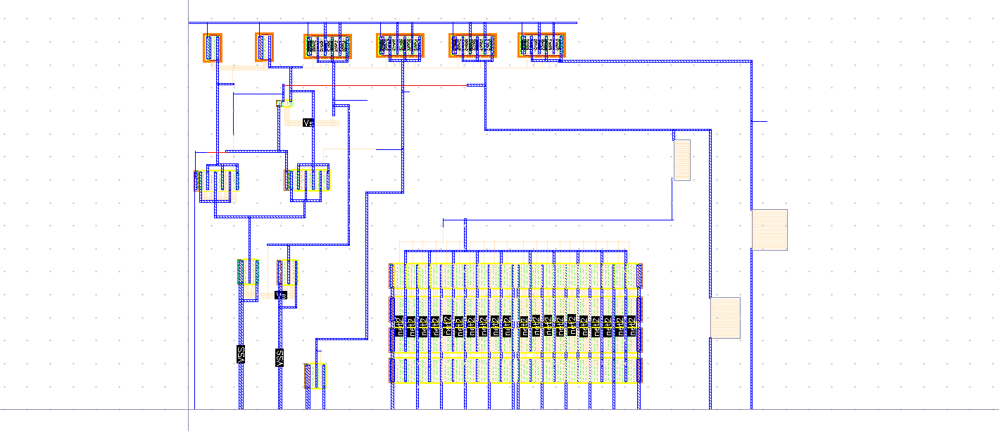
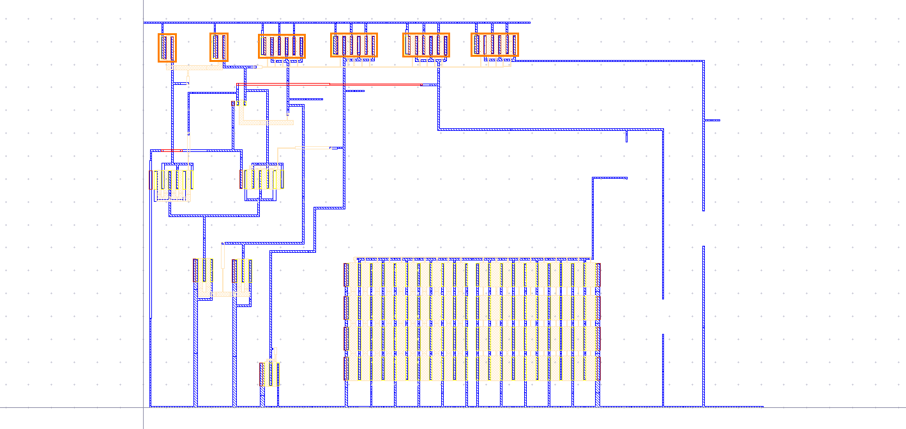

# Layout Design & Verification

## 1. Layout Overview

- **Tool:** Cadence Virtuoso Layout Suite
- **Technology:** GPDK 180 nm CMOS
- **Supply Rail:** 1.8 V

The layout includes all circuit blocks:
- Mirrored PMOS/NMOS device arrays (top row)
- Multi-finger poly-resistor bank implementing R0–R2 (bottom array, `net1`/`net2` fingers)
- Power and ground rails, with VSS brought out at two separate taps
- Internal nodes Va, Vb routed and labeled

*(Dark-theme capture: `images/layout/BGR_layout_full_dark.png`, net-labeled routing view: `images/layout/BGR_layout_labeled_nets.png`)*

---

## 2. DRC (Design Rule Check)

DRC verifies that all layout geometries satisfy the foundry's manufacturing rules.

**Rules checked include:**
- Minimum poly/diffusion/metal widths
- Minimum spacing between same/different layers
- Enclosure of contacts/vias
- N-well and P-well rules
- Antenna rules

**Result: ✅ Zero DRC errors**

> ℹ️ No DRC summary-window screenshot was supplied yet. Drop one in as `images/layout/BGR_drc_report.png` to have it embedded here.

---

## 3. LVS (Layout Versus Schematic)

LVS extracts the netlist from the layout and compares it to the schematic netlist.

**Checks performed:**
- Device matching (same type, size, number)
- Net connectivity (all connections match)
- No opens or shorts introduced in layout

**Result: ✅ LVS Clean — Layout matches schematic**

> ℹ️ No LVS summary-window screenshot was supplied yet. Drop one in as `images/layout/BGR_lvs_report.png` to have it embedded here.

---

## 4. AV Extraction — Parasitic Extraction (PEX)

*(Dark-theme capture: `images/layout/BGR_layout_av_extraction_dark.png`)*

**Parasitics extracted:**
- Parasitic resistance of metal 1 and metal 2 interconnects
- Contact and via resistances
- Parasitic capacitances (metal-to-metal, metal-to-substrate)

**Impact on circuit:**
- V_REF shifts by ~1-2 mV (acceptable)
- Temperature response shape unchanged
- Startup behavior unaffected

---

## 5. Layout Best Practices Used

| Practice | Applied? | Details |
|----------|---------|---------|
| Common-centroid BJTs | ✅ | Q2 = 8 cells around Q1 for matching |
| Guard rings | ✅ | N-well ring around PMOS, P-substrate ring around NMOS |
| Symmetrical current mirror | ✅ | MP1, MP2, MP3 in same row |
| Dummy devices at edges | Recommended | Reduces edge effects |
| Wide power rails | ✅ | Reduces IR drop |
| Separate analog/digital grounds | N/A | Purely analog circuit |
